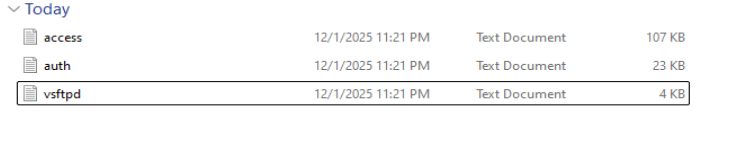

# Juicy Details

Scenario: A shop has been breached by an attack. I have been provided log files to investigate the incident. As a SOC Analyst, I need to find out how the company has been breached and what data have they stolen. 

At first glance, they evidence they have provided me are three text document. My first thought is to investigate what seems abnormal? (Any reconnaissance tools has been used? What user agents has been recorded in the access logs? What endpoint may have been attacked?) Naturally I would investigate the access log file. 

After doing a quick glace on the access file, I’ve noticed the following tools being used: `nmap, hydra, sqlmap, curl, feroxbuster`. Which are common attack tools for hackers, so this has brought my attention that an attack was being attempted, now to perform a deep investigation to see what really happened. 

I went back to investigate the brute force attempt that the threat has performed. Hydra being a popular tool to perform brute force attack, this activity shows `/rest/user/login` being vulnerable and exposed. I checked if there were any successful logins by looking for response code 200 and I was able to find one successful login for an *application* account inside the Juice Shop app. Although the logs provided didn’t provide enough information on what account was breached, I decided to move on.

Next I wanted to investigate if they found any vulnerabilities using sqlmap. Upon investigating the access logs, I found that sqlmap was used on `/rest/products/search` with "q" being the parameter and based on the activity, they were collecting information. 

I followed the sql trail to see what information they pulled. Some common words I am looking that hackers will try to retrieve are “names, credit cards numbers, emails, password” and luckily I was able to find email and password in the sql trail. Indicating that they were able to collect sensitive information. 

Next, the threat used ferobuster which is a forced browsing for hidden paths. They were able to find `/ftp` but fails to extract files due to no permission (403). Instead, they try a different method by trying to login to the ftp based on the timeline. 

I followed the trail and it leads to two files that were downloaded which are `“/www-data.bak”` & `“/coupons_2013.md.bak”` via `FTP`. I viewed the vsftpd log to confirm this activity and sure enough, the download was successful. I was also able to find that the user “`anonymous`” was used to download the file which is a common misconfiguration for FTP service.

Following the timeline, I checked the auth log to see if I can find any missing information and I was able to find large amount of failed logged in attempted followed by a successful login for the user: `www-data`. My first thought was how did the threat found the credentials for the user `www-data` to access the server via ssh and the only possible explanation that I was able to think was that the threat user were using the downloaded file with emails and passwords to perform a brute force attempt. 

In summary: 

- Recon with Nmap to find open ports, may found ftp service port open
- scrapes creds from product reviews.
- Used Hydra to brute force on `/rest/user/login` and there was one successful login
- With app access available, the attacker then moves to:
    - mysql discovery and exploitation on `/rest/products/search` (sqlmap → curl) Curl for retrieval of the results, probably to save them to a file
    - Forced browsing for hidden paths (feroxbuster), which finds /ftp but fails to extract files due to no permission. tries a different method by trying to login to the ftp since the services is open
    - Logins in as Anonymous to perform FTP download of sensitive backup
    - SSH brute force and successful login as `www-data`
    - Local privilege escalation attempts (su, sudo)